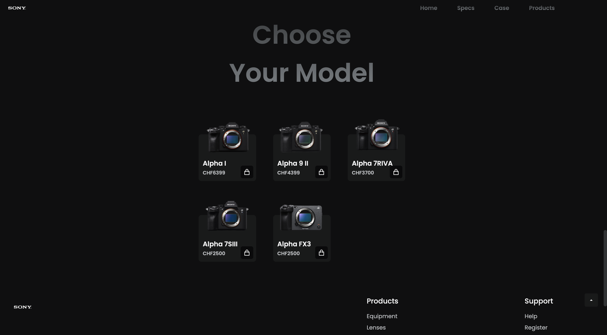
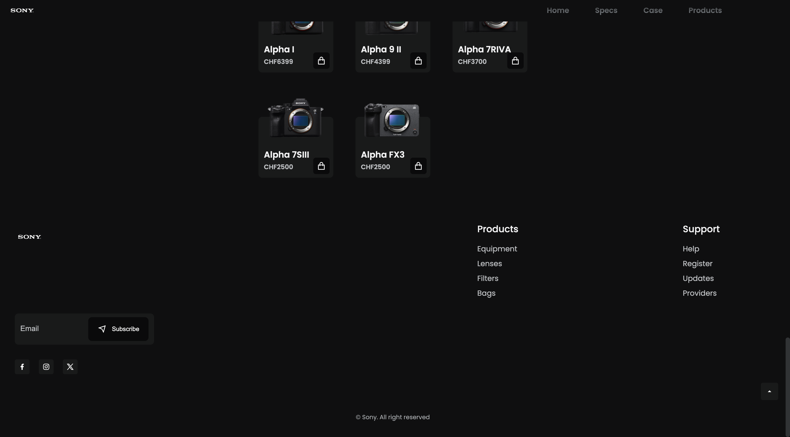

# Sony Camera Website Concept
This project is a minimalist and aesthetic website concept for Sony cameras, 
designed with a black, white, and light gray color scheme. As a huge fan of Sony cameras 
(and a proud owner of one), I focused exclusively on showcasing Sony Camera products. 
The site was created as an exercise to improve my skills in HTML, CSS, and JavaScript.

---------------------------------------------------------------------------------------------------------------------------

           

    

---------------------------------------------------------------------------------------------------------------------------

# Features

- Home Page: A clean and simple landing page introducing Sony cameras.
- Specs Page: Detailed specifications for the featured camera model.
- Case Page + Discount: Information about available cases with special discounts.
- Products Page: A selection page featuring various Sony camera models.
- Footer: Includes an email subscription form (currently non-functional), social media buttons, and links to additional resources and support.

The website is fully responsive and optimized for both web and mobile devices.

# Acknowledgements
Special shout-out to @jlmakes for the ScrollReveal script that adds smooth scroll animations to the site.

# Demo/ Preview of the Website

- Desktop Version:

https://github.com/user-attachments/assets/710c5356-ad11-47d2-b2bc-08f611c5835b

- Mobile Version:

https://github.com/user-attachments/assets/3ff7743c-55f4-40b3-b28d-f2b637aeff29

